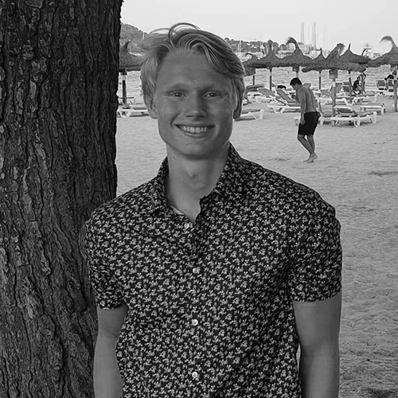

# ImageApplication  


ImageApplication is an Application for uploading and keeping track on your photos. With ImageApplication you can upload files, extract metadata, create albums and view images on map. 
If you have been on holiday and want to view where you took the photos, simply create an album and press view on map. 

## Table of content
 [[_TOC_]] 

## Get started 
These instructions will help you get a copy of our project for development and testing purposes.


### Prerequisits
* Git
* Java SDK 11 or newer
* Intellij IDEA or other code editors

### Downloading the project
For getting a copy of our project you will need to clone the repo. This is done by running the following command; 

***For ssh:***
```
git clone git@gitlab.stud.idi.ntnu.no:eirsteir/team-14-software-engineering.git
```

***For https:***
```
git clone https://gitlab.stud.idi.ntnu.no/eirsteir/team-14-software-engineering.git
```


### Database configuration
A config.properties file is required to run this project. Please refer to a project maintainer if you want to use our database.
Otherwise you can use your own database by filling out the following;


```
# Database Connection Properties
DB_DRIVER=com.mysql.cj.jdbc.Driver
DB_URL=jdbc:mysql://your_database_url_here
DB_USER=your_username_here
DB_PASSWORD=your_password_here
DB_DIALECT=org.hibernate.dialect.MySQL8Dialect

# Google Maps API Key
GOOGLE_API_KEY=your_google_maps_api_key_here

```

#### IntelliJ:
*Follow these steps to run the project:*
- Open the Maven Projects window in `View -> Tool Windows -> Maven` and click on  `ImageApplication -> Plugins -> javafx -> javafx:compile` and then `javafx:run` to execute the project

## Questions or need help?
For futher questions we would recommend reading our wiki and javadoc

*[Our wiki page can be found here](https://gitlab.stud.idi.ntnu.no/eirsteir/team-14-software-engineering/-/wikis/home)*

*[Our javadoc can be read here](http://eirsteir.pages.stud.idi.ntnu.no/team-14-software-engineering)*

## Link to trello taskboard
*https://trello.com/invite/b/tYlmd1fp/91a74daa94354d49819ac28980c682e5/team-14*

## Authors

 

**Eirik Steira -** ***Technical Leader***


**Nicolay Schiøll-Johansen -** ***Team Leader***



**Stian Mogen -** ***Welfare Minister and Deputy Leader***


**Simon Jensen -** ***Meeting referencer***


**Mads Lundegaard -** ***Developer***


**Lars Brodin Østby -** ***Developer***